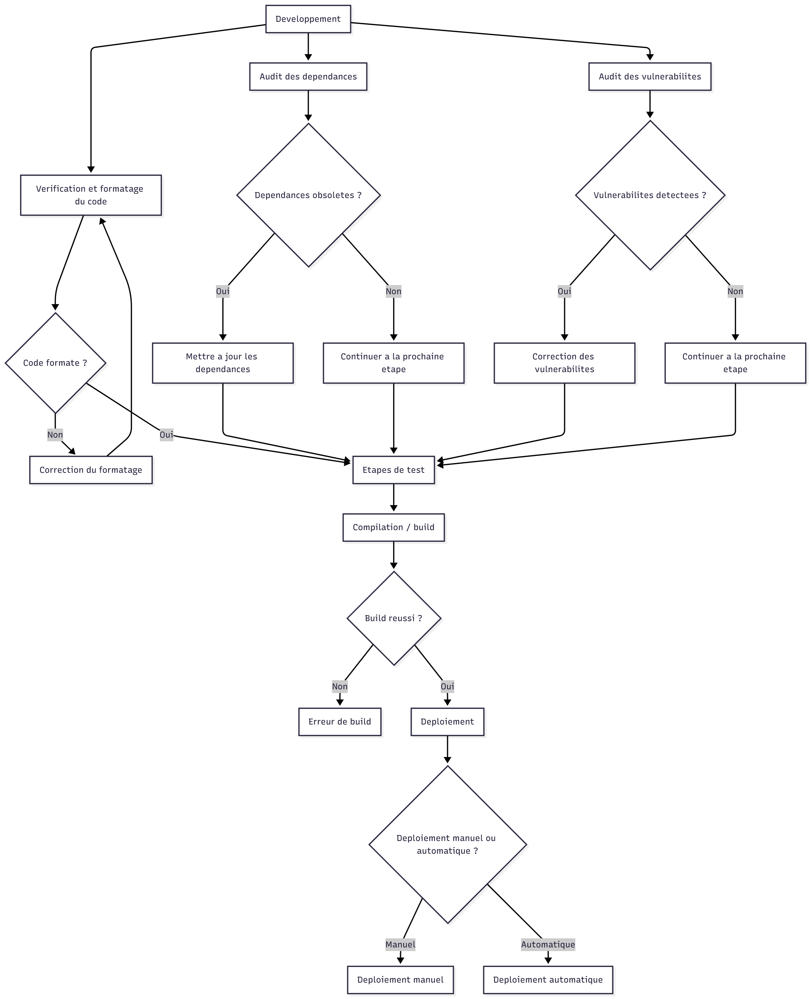

# Plan CI/CD – Projet MOSBAM P Cloud (version ETML)

## 0. Contexte du projet

Le projet **MOSBAM P Cloud** est une application web simple composée :

- d’un **backend Node.js / Express** qui expose une API REST ;
- d’un **frontend Vue 3 / Vite** qui consomme cette API ;
- d’une base de données **MySQL** pour stocker les données ;
- le tout prévu pour tourner dans des **conteneurs Docker**, hébergés sur une plateforme type **Azure** (ou autre PaaS équivalent).

L’objectif du plan CI/CD est de définir **comment on passe du code sur GitHub à une application en production**, de façon assez automatisée mais **réaliste pour un travail de CFC à l’ETML** (binôme, temps limité, ressources simples).

---

## 1. Objectifs du pipeline

### 1.1 Fréquence des déploiements

- **Objectif** : pouvoir déployer une version stable **toutes les 2 semaines** environ, et faire des **petits correctifs** plus rapides si nécessaire.
- **Pourquoi** : ce rythme reste raisonnable pour un binôme d’apprentis (temps de cours, autres modules), tout en permettant d’avancer régulièrement.

### 1.2 Besoins en rollback (retour arrière)

- En cas de problème en production, on veut pouvoir **revenir à la version précédente**.
- Idée simple :
  - on garde les **images Docker taguées** (par ex. `frontend:v1.2.0`, `backend:v1.2.0`) ;
  - avant chaque déploiement, on fait une **sauvegarde de la base de données** (dump MySQL) ;
  - en cas de bug grave, on redéploie l’ancienne image et on restaure la sauvegarde.
- **Pourquoi** : c’est une approche compréhensible et suffisante pour un projet scolaire, sans aller dans des stratégies trop complexes (blue/green, canary, etc.).

### 1.3 Sécurité et conformité

- Le code est stocké sur **GitHub** avec :
  - des **branches de travail** (`feature/…`) ;
  - des **pull requests** vers `develop` puis `main` ;
  - une règle : **CI verte obligatoire avant merge**.
- Les **secrets** (mots de passe DB, clés API) ne sont **jamais dans le code**, mais dans :
  - les **variables secrètes GitHub Actions** ;
  - ou un coffre-fort type **Azure Key Vault** si disponible.
- Un audit de base est fait avec :
  - `npm audit` pour repérer les dépendances vulnérables ;
  - un **linter** (ESLint) pour éviter les erreurs grossières.

### 1.4 Performances attendues

- Le frontend est **compilé** avec Vite (fichiers optimisés, minifiés).
- Le backend tourne dans un **conteneur** avec un nombre raisonnable d’instances (1–2 pour notre cas).
- On prévoit au minimum :
  - quelques **tests de base** (charger une page, appeler une API) ;
  - vérifier que le temps de réponse reste acceptable pour un petit projet (par exemple < 1 s dans les cas simples).

### 1.5 Contraintes techniques identifiées

- **Monorepo** avec frontend + backend → il faut que le pipeline sache traiter les deux parties.
- **MySQL** comme base de données → migrations ou scripts SQL à exécuter avant la mise à jour.
- Environnement scolaire → on privilégie des outils **gratuits** ou déjà fournis (GitHub, Docker, Azure étudiant, etc.).

---

## 2. Analyse technique

### 2.1 Technologies utilisées et impact CI/CD

- **Frontend : Vue 3 + Vite**
  - Besoin d’une étape `npm install` puis `npm run build` ;
  - possibilité d’ajouter `npm run test` si on écrit des tests unitaires.
- **Backend : Node.js / Express**
  - Besoin d’installer les dépendances (`npm install`) ;
  - exécution de tests (`npm test`) ;
  - création d’une image Docker pour la prod.
- **Base de données : MySQL**
  - Une instance MySQL (locale en dev, managée en prod) ;
  - scripts de création/migration à lancer si le schéma change.
- **Docker**
  - Permet d’avoir le même environnement en dev, test et prod ;
  - images poussées sur un **registry** (par ex. GitHub Container Registry ou Azure Container Registry).

### 2.2 Hébergement et sécurisation

- **Hébergement** :
  - En **dev** : Docker Compose en local ;
  - En **prod** : plateforme type **Azure Container Apps** ou une VM Docker.
- **Sécurisation minimale** :
  - communication HTTP(s) sécurisée (certificat via reverse-proxy ou service managé) ;
  - ports de la base de données **non exposés sur Internet**, uniquement accessibles depuis le backend ;
  - mots de passe suffisamment forts et non stockés dans le code.

### 2.3 Environnements de déploiement

| Environnement | Usage principal                               | Déploiement         |
| ------------- | --------------------------------------------- | ------------------- |
| Dev local     | Développement individuel                      | Manuel (Docker)     |
| Intégration   | Tester les branches `develop`                 | Automatique (CI)    |
| Staging       | Vérifier une release avant la prod            | Semi-auto (approb.) |
| Prod          | Version utilisée par les “vrais” utilisateurs | Semi/auto (tag)     |

### 2.4 Variables d’environnement

Exemples de variables nécessaires :

- `DB_HOST`, `DB_PORT`, `DB_USER`, `DB_PASSWORD`, `DB_NAME` : connexion MySQL ;
- `PORT_API`, `PORT_FRONT` : ports d’écoute ;
- `NODE_ENV` : `development` / `production` pour activer certains comportements.

### 2.5 Secrets à protéger

- Mots de passe de la base de données ;
- Clés API externes (mail, paiement, etc.) ;
- Eventuels tokens (webhooks, bots, etc.).

Ces secrets sont stockés dans :

- **GitHub Actions Secrets / Environments** pour la CI/CD ;
- éventuellement un **key vault** côté cloud pour l’exécution en production.

---

## 3. Conception du pipeline CI/CD

### 3.1 Vue d’ensemble

Le pipeline sera géré par **GitHub Actions**.  
Déclencheurs principaux :

- push sur une branche `feature/*` → CI basique (tests) ;
- push / PR vers `develop` → CI complète + déploiement sur environnement d’intégration ;
- création d’un **tag** `vX.Y.Z` sur `main` → pipeline de release + déploiement en production.

### 3.2 Étapes du pipeline (exemple)

1. **Checkout du code**

   - Outil : `actions/checkout`.
   - Feedback : logs de l’action, échec immédiat si le repo n’est pas accessible.

2. **Installation des dépendances**

   - Outil : `npm install` dans le dossier backend, puis dans le dossier frontend.
   - Feedback : temps d’installation, erreurs de dépendances.

3. **Vérification du code (lint/format)**

   - Outil : `npm run lint` (ESLint) et éventuellement `npm run format` (Prettier).
   - Feedback : liste des erreurs de style ou de syntaxe, échec si des problèmes bloquants sont trouvés.

4. **Tests unitaires backend et frontend**

   - Outil : `npm test` ou équivalent (Jest, Vitest, …).
   - Feedback : rapport de tests (succès / échecs), nombre de tests passés.

5. **Audit des dépendances (simple)**

   - Outil : `npm audit --production` (ou équivalent) sur backend et frontend.
   - Feedback : rapport des vulnérabilités connues, possibilité de marquer l’étape en “warning” plutôt que “échec” si on veut rester raisonnable.

6. **Build du frontend**

   - Outil : `npm run build` dans le dossier frontend.
   - Feedback : succès/échec du build, taille du bundle.

7. **Build des images Docker**

   - Outil : `docker build` pour `frontend` et `backend` ;
   - Tags : `frontend:commit-sha`, `backend:commit-sha` + éventuellement `frontend:vX.Y.Z` pour les releases.
   - Feedback : logs de build, taille des images.

8. **Push des images sur le registry**

   - Outil : `docker push` vers GitHub Container Registry ou Azure Container Registry.
   - Feedback : confirmation que les images sont bien publiées.

9. **Déploiement sur les environnements**

   - Intégration : déploiement automatique après succès de la CI sur `develop` ;
   - Staging/Prod : déploiement déclenché par un **tag** + éventuellement une **validation manuelle** dans GitHub Actions.
   - Outil : script de déploiement (Docker / Azure CLI / Github Actions) qui met à jour les images utilisées par les services.

10. **Notifications**
    - Exemple : message sur un canal Discord / Teams, ou simplement statut visible dans GitHub Actions.
    - Feedback : l’équipe sait si le déploiement a réussi ou non.

### 3.3 Schéma du pipeline

## 4. Suivi et amélioration continue

### 4.1 Monitoring

Après la mise en production, on souhaite au minimum :

- des **logs applicatifs** (backend) lisibles et centralisés ;
- quelques **indicateurs** : nombre d’erreurs 500, temps de réponse moyen, disponibilité ;
- une **page de santé** (endpoint `/health`) pour savoir si l’API répond correctement.

Si on utilise Azure :

- **Azure Monitor / Application Insights** peuvent être utilisés pour suivre les requêtes et les erreurs ;
- on peut configurer des **alertes** (par e-mail) si le service ne répond plus ou si le nombre d’erreurs est trop élevé.

### 4.2 Impact sur le projet

Ce monitoring sert à :

- détecter rapidement les bugs en production ;
- voir si certaines fonctionnalités posent problème (temps de réponse trop long, erreurs fréquentes) ;
- décider quoi corriger/améliorer en priorité dans les prochains sprints ;
- vérifier que le pipeline CI/CD permet réellement de livrer plus sereinement.

### 4.3 Amélioration continue

- À la fin de chaque itération (par ex. toutes les 2 semaines), le binôme peut faire une **petite rétrospective** :
  - Qu’est-ce qui a bien fonctionné dans la CI/CD ?
  - Qu’est-ce qui a posé problème (tests, temps de build, déploiement) ?
  - Quelles règles ou étapes peut-on simplifier ou améliorer ?
- Les conclusions peuvent être notées dans un petit document (ex. `docs/retrospectives.md`).
